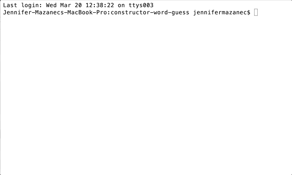

# Constructor Word Guess Game

This application uses Letter and Word constructors to set up and run a game of hangman. At the start of the game, a word is randomly chosen from an array and a new Word object is created using the Word constructor. A Letter object is created for each of the letters in the word using the Letter constructor. Then, using a stringWord method in the currentWord object, the word is displayed in the console with all characters excluding spaces respresented by an underscore.

Then, the inquirer node module is used to prompt the user to guess a letter. If the guess is in the currentWord, it is filled in. The user continues to guess letters until the entire word is filled in. At that point, the user is asked if they would like to play again. If they answer "Yes", then a new word is chosen and the game starts over. If they select "No", the message "Thanks for playing!" displays in the console.

To run the game, clone this repository, run `npm install` in the terminal at the cloned repository's location on your machine, and then run the command `node index.js` to start the game.

